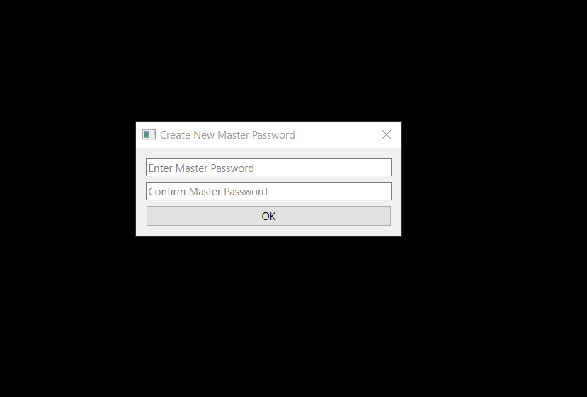
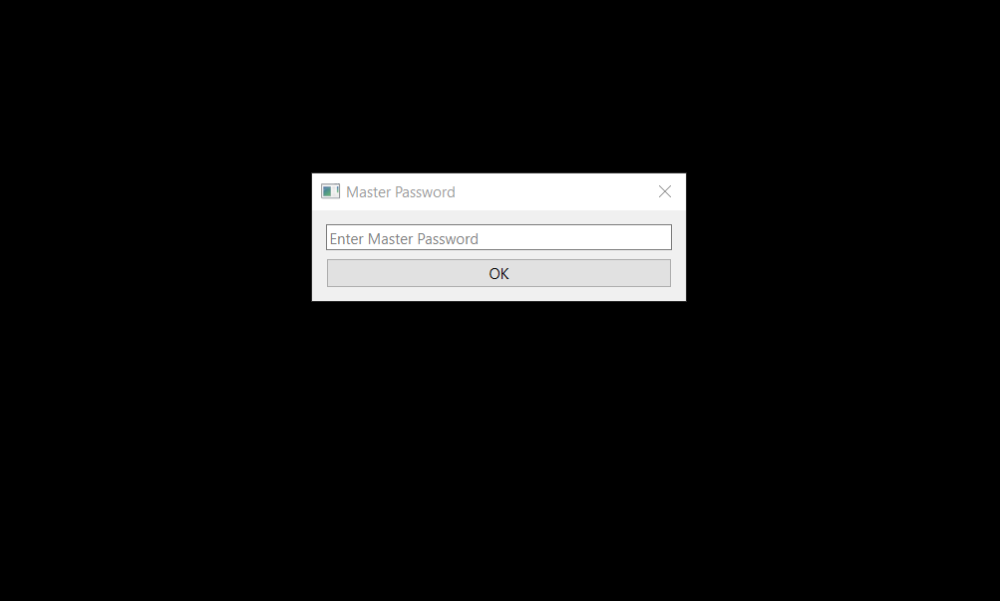
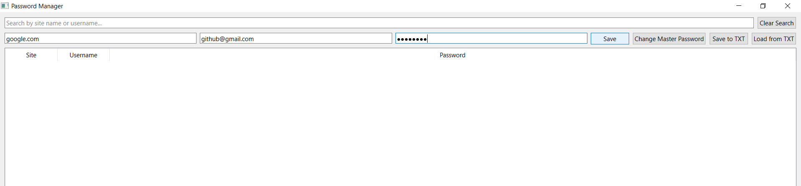
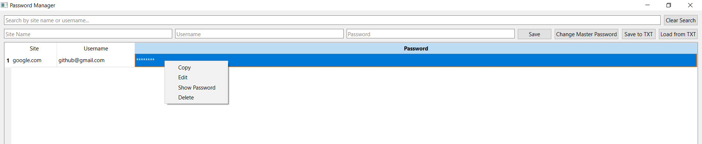
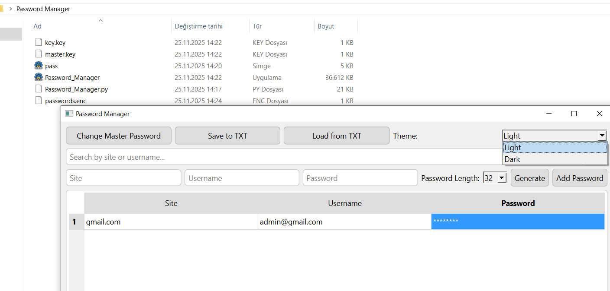

🔐 Simple Encrypted Desktop Password Manager

A lightweight desktop password manager built with Python and PyQt6, featuring encrypted local storage using Fernet symmetric encryption.

## 🚀 Features

- Save passwords with associated website and username
- View all saved entries in a table
- Delete individual entries
- Simple and clean graphical interface
- Multiple Themes

## ⚙️ Installation

> **Requirements:**  
> - Python 3.10+  
> - pip  

1. Clone this repository or download the source files.

2. Install dependencies:
   ```bash
   pip install PyQt6 cryptography pyperclip winreg webbrowser
   ```

3. Run the application:
   ```bash
   python Password_Manager.py
   ```

## 🛠️ Build Executable (.exe)

To create a standalone Windows executable of the application:

1. Install `pyinstaller` if you haven't:
   ```bash
   pip install pyinstaller
   ```

2. Run the following command to generate the `.exe`:
   ```bash
   pyinstaller --onefile --windowed  --icon=pass.ico Password_Manager.py
   ```

3. After building, the executable file will be located in the `dist` folder as `Password_Manager.exe`.

> **Note:**  
> - Use `--windowed` to hide the terminal window (recommended for GUI apps).  
> - If your script depends on other files (like icons or `.ui` files), you may need to bundle them manually or adjust the `pyinstaller` command.


---

📦 Ready-to-Use Executable

If you don’t want to build the executable yourself, a pre-built Windows version is available:


➡️ Download [Password_Manager.exe]((https://github.com/CodeVaultX/simple-encrypted-password-manager/releases/download/v1.0/Password_Manager.exe)).

Simply download and run the .exe file — no installation or Python required.

    ⚠️ Note: Make sure to keep Password_Manager.exe and the created passwords.enc file in the same folder for proper functionality.

## 🔐 How It Works

- Stores passwords in a local database (`passwords.enc`).
- Each entry includes a website, username, and password.

## 📁 Files

- `Password_Manager.py`: Main application file (PyQt6 UI + database logic)
- `passwords.enc`: Created automatically to store saved data
- `README.md`: Project description and usage guide

> 💡 **Tip:**  
> It is recommended to create a folder named `Password Manager` and place the `Password_Manager.py` file inside it.  
> This way, any files created by the program (like `passwords.enc`) will stay organized within that folder.


## 🖥️ Screenshot

  
  
  
  
  
*The main interface of the Password Manager.*

## 🛡️ Security Note

This application uses AES encryption via the cryptography library to securely store passwords on disk. A randomly generated Fernet key is saved locally in a file. For improved security, especially for production usage, consider protecting the encryption key with a password-based key derivation function (KDF), and enhancing authentication mechanisms.

## 📄 License

Licensed under the [Apache License 2.0.](https://github.com/CodeVaultX/simple-encrypted-password-manager/blob/main/LICENSE).
